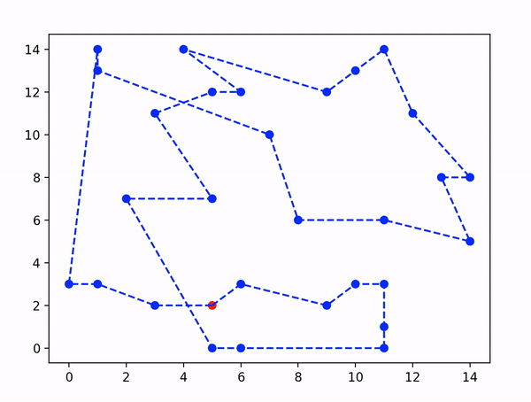
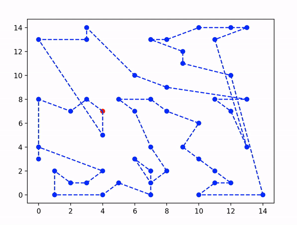

In this repository we will apply the ACO metaheuristic to the well-known Travelling Salesman Problem. The implemented algorithm has an educational intention, so no improvements such as elitism or Hill Climbing exploitation have been implemented. 

In the problem_instances folder 3 instances of the computational problem have been collected, specifically with 12, 30 and 50 nodes.

Below we can see the result of the algorithm for 30 and 50 nodes. The selected parameters are:

* n_ants: 100 
* rho: 0.1
* alpha: 0.6
* beta: 3.0
* max_iter: 500

# 30 Nodes

# 50 Nodes

Feel free to modify the parameters as you like and see if you can improve the results shown.